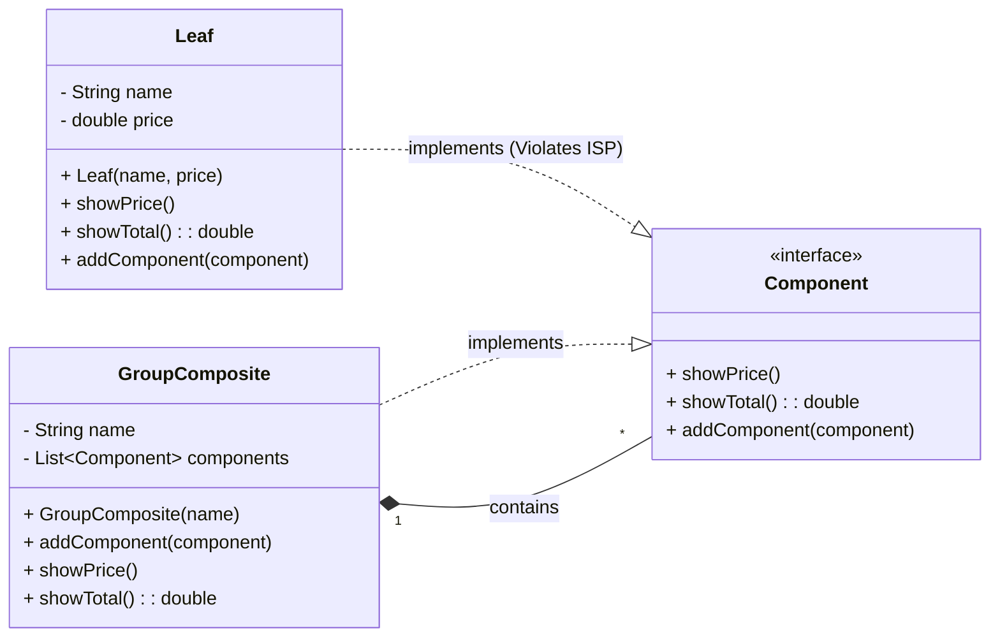

## Diagrama UML para o Antipattern Composite

```mermaid
classDiagram
    direction LR

class Component {
    <<interface>>
    + showPrice()
    + showTotal(): double
    + addComponent(component)
}

class Leaf {
    - String name
    - double price
    + Leaf(name, price)
    + showPrice()
    + showTotal(): double
    + addComponent(component)
}

class GroupComposite {
    - String name
    - List~Component~ components
    + GroupComposite(name)
    + addComponent(component)
    + showPrice()
    + showTotal(): double
}

Leaf ..|> Component : implements (Violates ISP)
GroupComposite ..|> Component : implements

GroupComposite "1" *-- "*" Component : contains
```