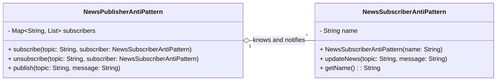

## Diagrama de UML para o Observer Antipattern

```mermaid
classDiagram
    direction LR

    class NewsSubscriberAntiPattern {
        - String name
        + NewsSubscriberAntiPattern(name: String)
        + updateNews(topic: String, message: String)
        + getName(): String
    }
    
    class NewsPublisherAntiPattern {
        - Map~String, List<NewsSubscriberAntiPattern>~ subscribers
        + subscribe(topic: String, subscriber: NewsSubscriberAntiPattern)
        + unsubscribe(topic: String, subscriber: NewsSubscriberAntiPattern)
        + publish(topic: String, message: String)
    }
    
    %% Relationship: Tight Coupling
    %% The Publisher is directly dependent on the concrete Subscriber class.
    NewsPublisherAntiPattern "1" o-- "*" NewsSubscriberAntiPattern : knows and notifies
```