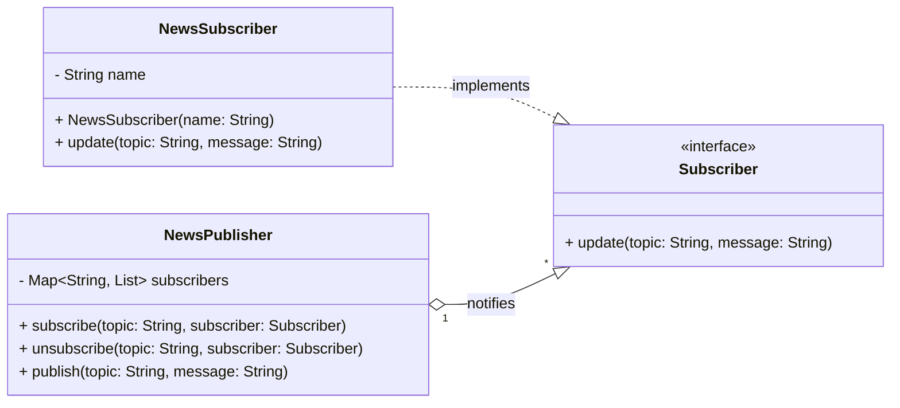

## Diagrama de UML para o Observer Pattern

```mermaid
classDiagram
    direction LR

    class Subscriber {
        <<interface>>
        + update(topic: String, message: String)
    }
    
    class NewsSubscriber {
        - String name
        + NewsSubscriber(name: String)
        + update(topic: String, message: String)
    }
    
    class NewsPublisher {
        - Map~String, List<Subscriber>~ subscribers
        + subscribe(topic: String, subscriber: Subscriber)
        + unsubscribe(topic: String, subscriber: Subscriber)
        + publish(topic: String, message: String)
    }
    
    NewsSubscriber ..|> Subscriber : implements
    NewsPublisher "1" o--|> "*" Subscriber : notifies
```