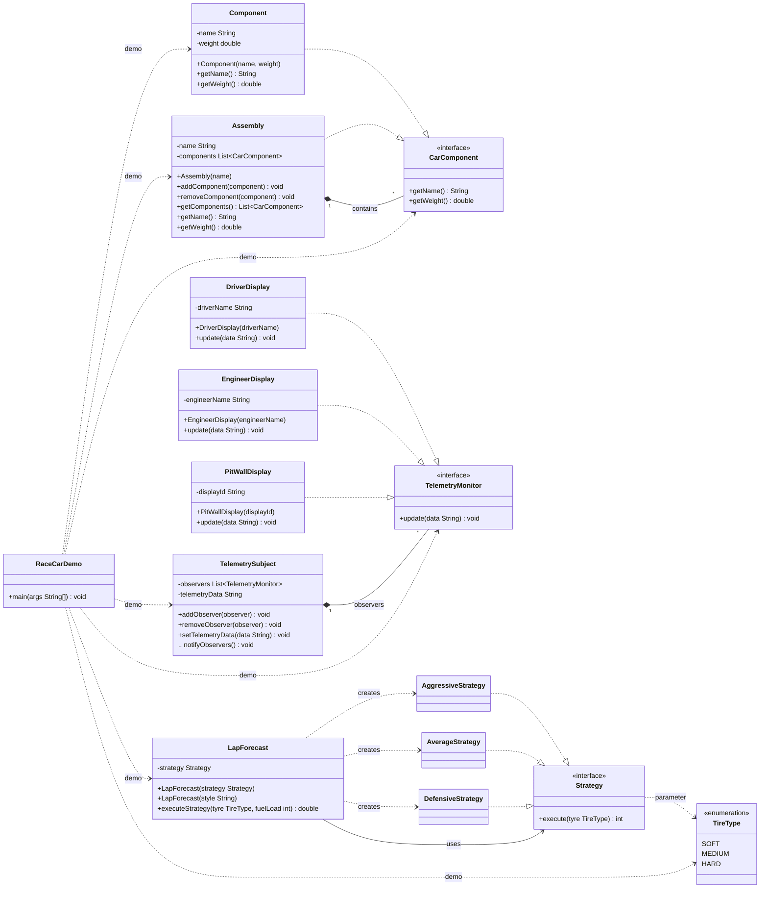

# RaceCar Project UML (Mermaid)

This module demonstrates multiple design patterns (Observer, Strategy, Composite) around a race car domain. The diagram below summarizes the core classes and their relationships.

Notes:
- Composite: Assembly aggregates multiple CarComponent elements (components can be other assemblies or leaf Components).
- Observer: TelemetrySubject keeps a list of TelemetryMonitor observers and notifies them whenever data changes.
- Strategy: LapForecast delegates lap prediction behavior to a Strategy implementation selected by constructor (Aggressive, Average, Defensive).