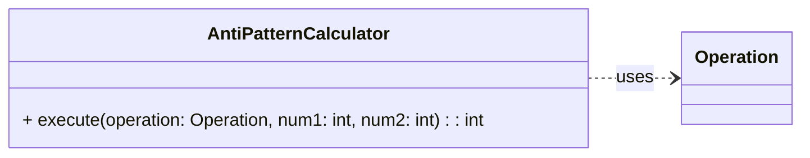

## Diagrama de UML para o Strategy Antipattern

```mermaid
classDiagram
    direction LR

    class AntiPatternCalculator {
        + execute(operation: Operation, num1: int, num2: int): int
    }
    
    AntiPatternCalculator ..> Operation : uses
```
